# slidekit — agent-first slide builder

<!-- ────────────────────────────────────────────────────────────────────────
     MSSE Capstone — grader entry point. Every required deliverable is one
     click below. Keep the links current; mark external ones when ready.
     ──────────────────────────────────────────────────────────────────────── -->

## 📚 MSSE Capstone deliverables (start here)

> **Grader access:** this repository is **private** — it must be **shared with the
> GitHub account [`quantic-grader`](https://github.com/quantic-grader)**
> (_Settings → Collaborators and teams → Add people_). Nothing below is gradable
> until that access is granted.

| Deliverable (per the Capstone Handbook) | Link | Status |
|---|---|---|
| **Working code** — the software system, appropriately documented | [`src/slidekit/`](src/slidekit/) · [Quickstart](#quickstart) | ✅ in repo |
| **User stories** — Product Owner's backlog | [`docs/USER_STORIES.md`](docs/USER_STORIES.md) | ✅ in repo |
| **Agile task board** — all tasks + user stories, with completion status | [`ops/BOARD.md`](ops/BOARD.md) _(source: [`ops/board.yaml`](ops/board.yaml))_ | ✅ in repo |
| **Design & Testing document** — architecture decisions, patterns + reasons, deployment options + cost, and all testing done | [`docs/DESIGN_AND_TESTING.md`](docs/DESIGN_AND_TESTING.md) | ✅ in repo |
| **Automated tests** — the test suite | [`tests/`](tests/) · run with `pytest -q` (see [doc](docs/DESIGN_AND_TESTING.md#5-testing)) | ✅ in repo |
| **CI/CD** — GitHub Actions | [Actions tab](https://github.com/Victor-Palacios/SLaiDES/actions) · [`.github/workflows/`](.github/workflows/) | ✅ in repo |
| **Recorded demo/presentation** — 15–20 min, all members on camera + voiceover | _TODO: paste the Google Drive link (Anyone-with-link) here_ | ⬜ add before submission |
| **Deployed version** — _only if a web application_ | Review site: <https://delicate-malasada-1b3d2c.netlify.app/> _(password-gated — see note)_ | ⚠️ conditional |

> **On the deployed-version line:** slidekit is a **command-line tool / Python
> library**, not a web application, so the handbook's "link to the deployed
> version (_if a web application_)" is **N/A for the core deliverable**. The only
> deployed web component is the internal layout-review site (Netlify), which is
> **password-gated** — if you cite it for grading, give the grader access or a
> read-only view, otherwise leave this line marked N/A.

**Submission-side (not repo files, keep handy):** the signed final page of the
**Group Project Agreement**; evidence of **at least three sprints** (commit history
+ the board); the presentation must show a **government-issued ID** on camera and
be a single `.mp4`/`.mov` on Google Drive (Anyone-with-link).

---

**🔗 Layout feedback site: <https://delicate-malasada-1b3d2c.netlify.app/>** — the
password-gated gallery of all layouts (👍/👎 + comment per layout, from your
phone; see [web/README.md](web/README.md)).

A slide-generation system where layout correctness is **provable from source**
rather than verified by rendering screenshots. An agent authors a declarative
slide IR; a deterministic layout engine computes geometry from real font
metrics; a linter catches every defect class visual QA used to catch; a
compiler emits `.pptx`. See **[ops/PLAN.md](ops/PLAN.md)** — the source of truth
for scope, architecture, phase order, hard gates, and acceptance criteria.

## Why

```mermaid
flowchart TB
    subgraph old ["Old: render and inspect"]
        A["Write generation code<br/>≈6k tokens"] --> B["Render and rasterize<br/>soffice + pdftoppm"]
        B --> C["Vision-inspect screenshots<br/>≈15k image tokens / round"]
        C --> D["Patch code, re-render<br/>≈3k × 2–3 rounds"]
        D --> E["Deck ships<br/>≈50–70k tokens total"]
    end
    subgraph new ["New: compile and lint"]
        F["Author IR YAML<br/>≈3k tokens"] --> G["slidekit build<br/>layout + lint, 0 tokens"]
        G --> H["Fix from lint JSON<br/>≈1k, at most one round"]
        H --> I["Lint-clean .pptx ships<br/>≈5–8k tokens total"]
    end
    style C fill:#fdecea,stroke:#c0392b
    style E fill:#fdecea,stroke:#c0392b
    style G fill:#e8f8f2,stroke:#1e8e5a
    style I fill:#e8f8f2,stroke:#1e8e5a
```



**≈90% fewer tokens per deck.**

## Quickstart

```bash
# 1. Install (Python 3.11+) into a virtualenv
python3 -m venv .venv && .venv/bin/pip install -e ".[dev]"

# 2. Scaffold a themed starter deck, edit the copy, then build to PowerPoint
.venv/bin/slidekit new --template standard -o deck.yaml
#   …edit deck.yaml…
.venv/bin/slidekit build deck.yaml -o deck.pptx      # exit 0 = lint-clean .pptx
#   exit 1 → read the JSON lint errors and apply each error's suggested_fix

# 3. Other outputs
.venv/bin/slidekit build deck.yaml --pdf -o deck.pdf # PDF export
.venv/bin/slidekit catalog                           # list components + when to use each

# 4. Run the test suite
PATH="$PWD/.venv/bin:$PATH" .venv/bin/python -m pytest -q
```

The authoring workflow (all components, fields, and the build/fix loop) is in
[SKILL.md](SKILL.md); architecture and testing are in
[docs/DESIGN_AND_TESTING.md](docs/DESIGN_AND_TESTING.md).

## Repository map

| Path | What it is |
|---|---|
| `src/slidekit/` | The product: IR schema, layout engine, linter, emitters (pptx/pdf/html), catalog registry, selection/author pipeline, aesthetics scorer, verify harness |
| `tests/` | The gates — golden geometry, lint, determinism, sync tests for every generated file |
| `examples/` | One specimen deck per component (`NN_<component>.yaml`) + composition showcases; canonical PDFs in `examples/pdf/`, dated review snapshots in `examples/pdf/combined/` |
| `scripts/` | Generators for every derived artifact (board, taxonomy, selection guide, examples index, combined PDF, web previews, feedback renders) — each with a sync test |
| `docs/` | Component catalog, layout taxonomy, selection guide, aesthetics spec, research bibliography |
| `web/` + `netlify/` + `netlify.toml` | The private layout-feedback website (password-gated Netlify site; see [web/README.md](web/README.md)) |
| `ops/` | **Agent-ops state** — the plan, prompts, progress ledger, kanban board, feedback queue, session reports (details below) |
| [SKILL.md](SKILL.md) | The authoring skill: how an agent (or you) writes deck YAML with all 29 components |
| `integrations/` | slidekit-authored presentation-agent definitions (Phase 8; vendored snapshot pruned 2026-07-02) |

## How this repo gets built: unattended sessions

This project is built by scheduled, unattended Claude Code sessions
(ops/PLAN.md → "Overnight routine"). Each session is stateless; continuity
lives in `ops/`:

| File | Role |
|---|---|
| [ops/PLAN.md](ops/PLAN.md) | Immutable plan; re-read every session |
| [ops/NIGHTLY_PROMPT.md](ops/NIGHTLY_PROMPT.md) | The verbatim prompt each session runs (with dated addenda) |
| [ops/PROGRESS.md](ops/PROGRESS.md) | Phase/criterion checklist + gate status (canonical acceptance ledger) |
| [ops/BOARD.md](ops/BOARD.md) / [ops/board.yaml](ops/board.yaml) | Agile kanban view of active work — `board.yaml` is the source of truth, `BOARD.md` is generated by `scripts/render_board.py` |
| [ops/FEEDBACK.yaml](ops/FEEDBACK.yaml) / [ops/FEEDBACK.md](ops/FEEDBACK.md) | Operator layout-feedback queue (source of truth + generated view) — every `open` item is actionable |
| `ops/reports/` | One report per session — the morning check is the newest `*-exec-summary.md` here (older sessions in `archive/`) |
| [ops/IDEAS.md](ops/IDEAS.md) | Operator-curated idea ledger — nothing is acted on until you mark a line `(approved)`; sessions annotate it `→ queued as T-NNN` / `→ done` |
| [ops/NOTES.md](ops/NOTES.md) | Objections, decisions, and out-of-scope proposals |
| [ops/calibration_report.json](ops/calibration_report.json) | Phase 1 font-metric calibration evidence (the project's go/no-go gate record) |

The build workflow is [`.github/workflows/nightly.yml`](.github/workflows/nightly.yml),
running `anthropics/claude-code-action@v1` on Opus with the contents of
`ops/NIGHTLY_PROMPT.md` (tools: `Read,Edit,Write,Bash` + `WebSearch,WebFetch`).

**Current schedule — BURST MODE (2026-07-02):** every **2 hours until 8:00 AM
Pacific on 2026-07-02**, working the open feedback items with vision-assisted QA
(operator-authorized; every visual finding must be codified as a deterministic
check). After the deadline the workflow **disables itself** via the API; to run
again, re-enable it in the Actions tab (*Actions → nightly-slidekit → Enable
workflow*) and dispatch manually, or edit the cron + deadline in the workflow for
a durable schedule. (History: the original daily cron was disabled 2026-06-28
because it drained personal subscription credits; consider an `ANTHROPIC_API_KEY`
secret before restoring a standing schedule.)

**Ideas channel:** add a line to [ops/IDEAS.md](ops/IDEAS.md) and mark it
`(approved)` to sanction work beyond the plan — the build session queues it on the
board under the `ideas` epic and works it through the same gates, annotating the
line as `→ queued as T-NNN` then `→ done (commit …)`. (The automated PR-brainstorm
session that used to feed this file was retired 2026-07-02.)

### Leaving feedback on a layout (from your phone)

The primary way is the **private feedback website** (see [`web/README.md`](web/README.md)):
a password-gated Netlify site that shows every layout as a native preview (rendered from
resolved geometry, not screenshots) with a 👍/👎 + comment on each. Submitting commits your
marks to [`web/feedback-inbox/`](web/feedback-inbox); the
[`web-feedback-intake`](.github/workflows/web-feedback-intake.yml) workflow folds them into
[`ops/FEEDBACK.yaml`](ops/FEEDBACK.yaml) via `scripts/feedback_intake_web.py`. Access is a
single `SITE_PASSWORD` (Netlify edge function) — no third-party auth service.

`ops/FEEDBACK.yaml` is the source of truth (the earlier GitHub issue-form channel
was retired 2026-07-02 — the website is the only way in). The build session treats every
`status: open` comment as actionable: it queues a board task under the `feedback` epic,
makes the change through the usual gates, and marks the comment `done` (or `wontfix` with
a reason). No approval step — feedback you file is yours, so it's acted on directly.

### What a session works on

The core build (Phases 0–8) is complete; the component library stands at 29
components (21 distinct layout skeletons — see `docs/LAYOUT_TAXONOMY.md`).
Priority order (per the prompt's addenda):

1. **Open operator feedback** in `ops/FEEDBACK.yaml` — top priority, worked through
   the normal gates, confirmed with vision where authorized, every visual finding
   codified as a deterministic check.
2. **North star**: keep the registry/taxonomy/selection pipeline
   (`slidekit catalog` / `slidekit author` / `docs/LAYOUT_SELECTION_GUIDE.md`)
   correct and in sync; add genuinely-distinct layout skeletons.
3. **Background**: the deterministic aesthetic scorer (`slidekit score`) and the
   research bibliography (`docs/REFERENCES.md`, ~20 verified references reached).

### Operator setup (one-time)

1. Generate a subscription OAuth token by running **`claude setup-token`** on
   your machine, then add it as the **`CLAUDE_CODE_OAUTH_TOKEN`** repository
   secret (Settings → Secrets and variables → Actions). Sessions then draw
   from your Claude subscription rather than API billing. (`anthropic_api_key`
   is the alternative input if you'd rather bill an API key.)
2. Scheduled workflows only fire from the repository's **default branch**, which is
   **`main`** (set 2026-06-15). Session work lands there.
3. Optional: trigger a run manually via the workflow's **Run workflow**
   button (`workflow_dispatch`) to test the pipeline.

### Operator notes

- Morning check is one file: the newest `ops/reports/*-exec-summary.md`
  (plain-language readout; the sibling report has the technical detail).
- Each Opus session costs roughly **$7–50 of subscription usage**; the burst
  schedule multiplies that by the number of runs — keep an eye on your usage
  window, and prefer an `ANTHROPIC_API_KEY` secret for any standing schedule.
- Headless usage on subscription plans draws from a separate Agent SDK credit
  (effective June 15, 2026) — verify limits at
  https://code.claude.com/docs/en/headless before relying on scheduled runs.
