# slidekit — agent-first slide builder

A slide-generation system where layout correctness is **provable from source**
rather than verified by rendering screenshots. An agent authors a declarative
slide IR; a deterministic layout engine computes geometry from real font
metrics; a linter catches every defect class visual QA used to catch; a
compiler emits `.pptx`. See **[PLAN.md](PLAN.md)** — the source of truth for
scope, architecture, phase order, hard gates, and acceptance criteria.

## Why

```mermaid
flowchart TB
    subgraph old ["Old: render and inspect"]
        A["Write generation code<br/>≈6k tokens"] --> B["Render and rasterize<br/>soffice + pdftoppm"]
        B --> C["Vision-inspect screenshots<br/>≈15k image tokens / round"]
        C --> D["Patch code, re-render<br/>≈3k × 2–3 rounds"]
        D --> E["Deck ships<br/>≈50–70k tokens total"]
    end
    subgraph new ["New: compile and lint"]
        F["Author IR YAML<br/>≈3k tokens"] --> G["slidekit build<br/>layout + lint, 0 tokens"]
        G --> H["Fix from lint JSON<br/>≈1k, at most one round"]
        H --> I["Lint-clean .pptx ships<br/>≈5–8k tokens total"]
    end
    style C fill:#fdecea,stroke:#c0392b
    style E fill:#fdecea,stroke:#c0392b
    style G fill:#e8f8f2,stroke:#1e8e5a
    style I fill:#e8f8f2,stroke:#1e8e5a
```

**≈90% fewer tokens per deck.**

## How this repo gets built: the nightly routine

This project is built by a scheduled, unattended Claude Code session
(PLAN.md → "Overnight routine"). Each session is stateless; continuity lives
in files:

| File | Role |
|---|---|
| [PLAN.md](PLAN.md) | Immutable plan; re-read every session |
| [NIGHTLY_PROMPT.md](NIGHTLY_PROMPT.md) | The verbatim prompt each session runs |
| [PROGRESS.md](PROGRESS.md) | Phase/criterion checklist + gate status (canonical acceptance ledger) |
| [BOARD.md](BOARD.md) / [board.yaml](board.yaml) | Agile kanban view of active work — `board.yaml` is the source of truth, `BOARD.md` is generated by `scripts/render_board.py` |
| `NIGHTLY_REPORTS/` | One report per session — the morning check is the newest file here |
| [IDEAS.md](IDEAS.md) | PR-triage & brainstorm inbox — a second scheduled session appends dated, *approvable* ideas here (see below); nothing is acted on until you approve |
| [BRAINSTORM_PROMPT.md](BRAINSTORM_PROMPT.md) | The verbatim prompt the PR-brainstorm session runs |
| [NOTES.md](NOTES.md) | Objections and out-of-scope proposals |
| [docs/SLIDE_DESIGNS.md](docs/SLIDE_DESIGNS.md) | Catalog of the 40 slide components (Phase 9) |
| [docs/LAYOUT_TAXONOMY.md](docs/LAYOUT_TAXONOMY.md) | Honest map of the 40 components → ~25 distinct layout skeletons (generated from `src/slidekit/catalog/registry.py`) |
| [docs/AESTHETICS.md](docs/AESTHETICS.md) | Deterministic aesthetic-scoring spec (Phase 10) |
| [docs/REFERENCES.md](docs/REFERENCES.md) | Living bibliography of slide-aesthetics research (target ~20 verified) |
| [docs/RESEARCH_TRACE.md](docs/RESEARCH_TRACE.md) | Which paper influenced which scorer decision (paper → decision → code, with status) |
| `examples/pdf/` | Per-deck example PDFs (canonical, one per deck) plus `combined/` — a dated review archive (`all-examples_<date>.pdf` + `manifest.json` + `INDEX.md`) where `scripts/build_combined_pdf.py` mints a new snapshot only when deck layouts change |
| [docs/EXAMPLES_INDEX.md](docs/EXAMPLES_INDEX.md) | Generated inventory of every example deck (slide count + component sequence), produced by `scripts/build_examples_index.py`; a test keeps it in sync |

The build is [`.github/workflows/nightly.yml`](.github/workflows/nightly.yml). Its nightly
cron is **disabled as of 2026-06-28** (it ran daily on Opus against the personal Claude
subscription and was exhausting the usage window); it now runs **manually only** via
`workflow_dispatch` (Actions tab → *Run workflow*). To restore unattended runs, uncomment the
schedule block — ideally after pointing it at an `ANTHROPIC_API_KEY` secret so it no longer
draws from your subscription credits. It runs
`anthropics/claude-code-action@v1` on Opus with the contents of `NIGHTLY_PROMPT.md`,
tools scoped to `Read,Edit,Write,Bash` plus `WebSearch,WebFetch` for the research
task. (The plan's preferred mechanisms — Claude Code Routines or a local crontab —
aren't durable in the ephemeral cloud environment this repo is developed in;
see NOTES.md.)

A **second** session, [`.github/workflows/pr-brainstorm.yml`](.github/workflows/pr-brainstorm.yml)
(**manual only** — its nightly cron was disabled 2026-06-19 by operator request; run it on
demand from the Actions tab via *Run workflow*), runs `BRAINSTORM_PROMPT.md`: it reads the open
pull requests (read-only `gh`, `pull-requests: read`), evaluates each for utility against
`PLAN.md`, and appends *approvable* ideas to [IDEAS.md](IDEAS.md). It is brainstorm-only —
it never merges, comments on, or modifies PRs or product code; its sole write is `IDEAS.md`,
which you review and approve. **Closing the loop:** when you mark an item `(approved)` in
`IDEAS.md`, the nightly build picks it up (the sanctioned exception to its no-scope-additions
rule), queues it on the board under the `ideas` epic, and works it through the same gates —
annotating the `IDEAS.md` line as `→ queued as T-NNN` then `→ done (commit …)`.

### Leaving feedback on a layout (from your phone)

To comment on a specific slide layout, open **Issues → New issue → Layout feedback**
(the [`.github/ISSUE_TEMPLATE/layout-feedback.yml`](.github/ISSUE_TEMPLATE/layout-feedback.yml)
form — it renders as a native form in the GitHub mobile app, so no website or local setup
is needed). Pick the layout from the dropdown (all 40 components, generated from the
catalog so it can't drift), type your comment, and submit. To *see* the layouts first,
open the latest combined preview PDF under
[`examples/pdf/combined/`](examples/pdf/combined) — GitHub renders PDFs on mobile.

The [`feedback-intake`](.github/workflows/feedback-intake.yml) workflow (which only acts
on `feedback`-labelled issues **you** authored) records each comment in
[`FEEDBACK.yaml`](FEEDBACK.yaml) (the source of truth), regenerates the readable
[`FEEDBACK.md`](FEEDBACK.md), and closes the issue with a confirmation. The nightly then
treats every `status: open` comment as actionable: it queues a board task under the
`feedback` epic, makes the change through the usual gates, and marks the comment `done`
(or `wontfix` with a reason). No approval step — feedback you file is yours, so it's acted
on directly.

### What the nightly session does now

The core build (Phases 0–8) is complete. Each nightly run now pursues two tracks:

1. **Build** the current phase in `PROGRESS.md` — Phase 9 (grow the component
   library to **40 slide components** (~25 distinct layouts, see `docs/SLIDE_DESIGNS.md` /
   `docs/LAYOUT_TAXONOMY.md`) then Phase 10
   (a **deterministic aesthetic-scoring** layer over the resolved geometry — balance,
   alignment, whitespace, overlap, contrast, color harmony, cross-slide consistency —
   computed from source, never from screenshots; see `docs/AESTHETICS.md`).
2. **Research** — find and **verify** new work on mathematically defining or measuring
   slide aesthetics, log it to `docs/REFERENCES.md` with how it's used, and integrate
   concrete deterministic metrics into Phase 10. The bibliography grows toward **~20
   verified references**; nothing is cited without a confirmed primary source.

### Operator setup (one-time)

1. Generate a subscription OAuth token by running **`claude setup-token`** on
   your machine, then add it as the **`CLAUDE_CODE_OAUTH_TOKEN`** repository
   secret (Settings → Secrets and variables → Actions). Nightly runs then draw
   from your Claude subscription rather than API billing. (`anthropic_api_key`
   is the alternative input if you'd rather bill an API key.)
2. Scheduled workflows only fire from the repository's **default branch**, which is
   **`main`** (set 2026-06-15). Nightly work lands there.
3. Optional: trigger a run manually via the workflow's **Run workflow**
   button (`workflow_dispatch`) to test the pipeline.

### Operator notes (from PLAN.md)

- **Read night one's report before letting night two fire.** The Phase 1
  calibration gate is the project's kill-switch; that go/no-go should be a
  human decision.
- Morning check is one file: the newest entry in `NIGHTLY_REPORTS/`.
- Watch for the **first-light flag** in reports — `demo-5.pptx`, the first
  openable deck (end of Phase 5).
- Headless usage on subscription plans draws from a separate Agent SDK credit
  (effective June 15, 2026) — since this workflow authenticates with the
  subscription OAuth token, verify those limits at
  https://code.claude.com/docs/en/headless before relying on nightly runs.
- **The nightly cron is DISABLED (2026-06-28); the build runs on Opus only when manually dispatched** (~$7–50 of subscription usage per session).
  It fires every night (from the default branch, **`main`**) until you disable it
  (comment out the `schedule:` block).
- Each morning, the newest `NIGHTLY_REPORTS/*-exec-summary.md` is the plain-language
  readout; `docs/REFERENCES.md` shows research progress toward the ~20-reference goal.
