# slidekit — agent-first slide builder

<!-- ────────────────────────────────────────────────────────────────────────
     MSSE Capstone — grader entry point. Every required deliverable is one
     click below. Keep the links current; mark external ones when ready.
     ──────────────────────────────────────────────────────────────────────── -->

## 📚 MSSE Capstone deliverables (start here)

| Deliverable (per the Capstone Handbook) | Link | Status |
|---|---|---|
| **Working code** — the software system, appropriately documented | [`src/slidekit/`](src/slidekit/) · [Quickstart](#quickstart) | ✅ in repo |
| **User stories** — Product Owner's backlog | [`docs/USER_STORIES.md`](docs/USER_STORIES.md) | ✅ in repo |
| **Agile task board** — all tasks + user stories, with completion status | [`ops/BOARD.md`](ops/BOARD.md) _(source: [`ops/board.yaml`](ops/board.yaml))_ | ✅ in repo |
| **Design & Testing document** — architecture decisions, patterns + reasons, deployment options + cost, and all testing done | [`docs/DESIGN_AND_TESTING.md`](docs/DESIGN_AND_TESTING.md) | ✅ in repo |
| **Automated tests** — the test suite | [`tests/`](tests/) · run with `pytest -q` (see [doc](docs/DESIGN_AND_TESTING.md#5-testing)) | ✅ in repo |
| **CI/CD** — GitHub Actions | [Actions tab](https://github.com/Victor-Palacios/SLaiDES/actions) · [`.github/workflows/`](.github/workflows/) | ✅ in repo |
| **Recorded demo/presentation** — 15–20 min, presenter on camera + voiceover + photo ID | **[▶ Watch on Google Drive](https://drive.google.com/drive/folders/1XjqfruE0fXmLyWfuqAH_bC7AhvMJrfC5)** | ✅ recorded |
| **Deployed version** — _only if a web application_ | **N/A** — slidekit is an agent harness for deck authoring (CLI), not a web app | ➖ N/A |

> **On the deployed-version line:** slidekit is an **agent harness for deck
> authoring** — a command-line pipeline that constrains an agent's output and
> mechanically verifies every slide (geometry proven from font metrics, the linter as
> the gate) before emitting `.pptx`/`.pdf`. It is **not a web application**, so the
> handbook's "link to the deployed version (_if a web application_)" does **not
> apply** — there is no always-on service to deploy.

**Sprints:** the three completed sprints (S1–S3), their user stories, and the
constituent tasks are tracked in [`ops/board.yaml`](ops/board.yaml) → rendered to
[`ops/BOARD.md`](ops/BOARD.md); see also the sprint table in
[the Design & Testing doc](docs/DESIGN_AND_TESTING.md#6-sprints-and-process).

**Submission-side (not repo files):** this is an **individual (solo) capstone — no
Group Project Agreement applies**. Submit via the Quantic dashboard's **Submit
Project** buttons (repo link + demo link); the demo must show a **government-issued
ID** on camera and be a single `.mp4`/`.mov` on Google Drive (Anyone-with-link).

---

**🔗 Layout feedback site: <https://delicate-malasada-1b3d2c.netlify.app/>** — the
password-gated gallery of all layouts (👍/👎 + comment per layout, from your
phone; see [web/README.md](web/README.md)).

A slide-generation system where layout correctness is **provable from source**
rather than verified by rendering screenshots. An agent authors a declarative
slide IR; a deterministic layout engine computes geometry from real font
metrics; a linter catches every defect class visual QA used to catch; a
compiler emits `.pptx`. See **[ops/PLAN.md](ops/PLAN.md)** — the source of truth
for scope, architecture, phase order, hard gates, and acceptance criteria.

## Why

```mermaid
flowchart TB
    subgraph old ["Old: render and inspect"]
        A["Write generation code<br/>≈6k tokens"] --> B["Render and rasterize<br/>soffice + pdftoppm"]
        B --> C["Vision-inspect screenshots<br/>≈15k image tokens / round"]
        C --> D["Patch code, re-render<br/>≈3k × 2–3 rounds"]
        D --> E["Deck ships<br/>≈50–70k tokens total"]
    end
    subgraph new ["New: compile and lint"]
        F["Author IR YAML<br/>≈3k tokens"] --> G["slidekit build<br/>layout + lint, 0 tokens"]
        G --> H["Fix from lint JSON<br/>≈1k, at most one round"]
        H --> I["Lint-clean .pptx ships<br/>≈5–8k tokens total"]
    end
    style C fill:#fdecea,stroke:#c0392b
    style E fill:#fdecea,stroke:#c0392b
    style G fill:#e8f8f2,stroke:#1e8e5a
    style I fill:#e8f8f2,stroke:#1e8e5a
```



**≈90% fewer tokens per deck.**

## Quickstart

```bash
# 1. Install (Python 3.11+) into a virtualenv
python3 -m venv .venv && .venv/bin/pip install -e ".[dev]"

# 2. Scaffold a themed starter deck, edit the copy, then build to PowerPoint
.venv/bin/slidekit new --template standard -o deck.yaml
#   …edit deck.yaml…
.venv/bin/slidekit build deck.yaml -o deck.pptx      # exit 0 = lint-clean .pptx
#   exit 1 → read the JSON lint errors and apply each error's suggested_fix

# 3. Other outputs
.venv/bin/slidekit build deck.yaml --pdf -o deck.pdf # PDF export
.venv/bin/slidekit catalog                           # list components + when to use each

# 4. Run the test suite
PATH="$PWD/.venv/bin:$PATH" .venv/bin/python -m pytest -q
```

The authoring workflow (all components, fields, and the build/fix loop) is in
[SKILL.md](SKILL.md); architecture and testing are in
[docs/DESIGN_AND_TESTING.md](docs/DESIGN_AND_TESTING.md).

## Repository map

| Path | What it is |
|---|---|
| `src/slidekit/` | The product: IR schema, layout engine, linter, emitters (pptx/pdf/html), catalog registry, selection/author pipeline, aesthetics scorer, verify harness |
| `tests/` | The gates — golden geometry, lint, determinism, sync tests for every generated file |
| `examples/` | One specimen deck per component (`NN_<component>.yaml`) + composition showcases; canonical PDFs in `examples/pdf/`, dated review snapshots in `examples/pdf/combined/` |
| `scripts/` | Generators for every derived artifact (board, taxonomy, selection guide, examples index, combined PDF, web previews, feedback renders) — each with a sync test |
| `docs/` | Component catalog, layout taxonomy, selection guide, aesthetics spec, research bibliography |
| `web/` + `netlify/` + `netlify.toml` | The private layout-feedback website (password-gated Netlify site; see [web/README.md](web/README.md)) |
| `ops/` | Project ops — plan, progress ledger, agile board, feedback queue (details below) |
| [SKILL.md](SKILL.md) | The authoring skill: how an agent (or you) writes deck YAML with all 29 components |
| `integrations/` | slidekit-authored presentation-agent definitions (Phase 8; vendored snapshot pruned 2026-07-02) |

## Project operations (`ops/`)

Planning and process live in `ops/` and back the Capstone deliverables above:

| File | Role |
|---|---|
| [ops/PLAN.md](ops/PLAN.md) | Scope, architecture, phase order, and acceptance criteria |
| [ops/PROGRESS.md](ops/PROGRESS.md) | Phase/criterion checklist + gate status (acceptance ledger) |
| [ops/board.yaml](ops/board.yaml) / [ops/BOARD.md](ops/BOARD.md) | Agile board — sprints → user stories → tasks; `board.yaml` is the source of truth, `BOARD.md` is generated by `scripts/render_board.py` |
| [ops/FEEDBACK.yaml](ops/FEEDBACK.yaml) / [ops/FEEDBACK.md](ops/FEEDBACK.md) | Review-feedback queue (source of truth + generated view) — every `open` item is actionable |
| [ops/IDEAS.md](ops/IDEAS.md) | Idea backlog |
| [ops/NOTES.md](ops/NOTES.md) | Decisions and out-of-scope notes |
| [ops/calibration_report.json](ops/calibration_report.json) | Font-metric calibration evidence (the go/no-go gate record) |

### The review loop (feedback from your phone)

The private feedback website (see [`web/README.md`](web/README.md)) renders every deck
slide-by-slide from resolved geometry — not screenshots — with 👍 / 👎 / "add slide
before/after" + a comment on each slide. Submitting commits a mark to
[`web/feedback-inbox/`](web/feedback-inbox); the
[`web-feedback-intake`](.github/workflows/web-feedback-intake.yml) workflow folds it into
[`ops/FEEDBACK.yaml`](ops/FEEDBACK.yaml) via `scripts/feedback_intake_web.py`, where each
`open` item becomes an actionable task. This is the loop behind user stories US-15…US-18.
