# slidekit — agent-first slide builder

A slide-generation system where layout correctness is **provable from source**
rather than verified by rendering screenshots. An agent authors a declarative
slide IR; a deterministic layout engine computes geometry from real font
metrics; a linter catches every defect class visual QA used to catch; a
compiler emits `.pptx`. See **[PLAN.md](PLAN.md)** — the source of truth for
scope, architecture, phase order, hard gates, and acceptance criteria.

## Why

```mermaid
flowchart TB
    subgraph old ["Old: render and inspect"]
        A["Write generation code<br/>≈6k tokens"] --> B["Render and rasterize<br/>soffice + pdftoppm"]
        B --> C["Vision-inspect screenshots<br/>≈15k image tokens / round"]
        C --> D["Patch code, re-render<br/>≈3k × 2–3 rounds"]
        D --> E["Deck ships<br/>≈50–70k tokens total"]
    end
    subgraph new ["New: compile and lint"]
        F["Author IR YAML<br/>≈3k tokens"] --> G["slidekit build<br/>layout + lint, 0 tokens"]
        G --> H["Fix from lint JSON<br/>≈1k, at most one round"]
        H --> I["Lint-clean .pptx ships<br/>≈5–8k tokens total"]
    end
    style C fill:#fdecea,stroke:#c0392b
    style E fill:#fdecea,stroke:#c0392b
    style G fill:#e8f8f2,stroke:#1e8e5a
    style I fill:#e8f8f2,stroke:#1e8e5a
```

**≈90% fewer tokens per deck.**

## How this repo gets built: the nightly routine

This project is built by a scheduled, unattended Claude Code session
(PLAN.md → "Overnight routine"). Each session is stateless; continuity lives
in files:

| File | Role |
|---|---|
| [PLAN.md](PLAN.md) | Immutable plan; re-read every session |
| [NIGHTLY_PROMPT.md](NIGHTLY_PROMPT.md) | The verbatim prompt each session runs |
| [PROGRESS.md](PROGRESS.md) | Phase/criterion checklist + gate status |
| `NIGHTLY_REPORTS/` | One report per session — the morning check is the newest file here |
| [NOTES.md](NOTES.md) | Objections and out-of-scope proposals |

The schedule is [`.github/workflows/nightly.yml`](.github/workflows/nightly.yml):
a GitHub Actions cron job running `anthropics/claude-code-action@v1` with the
contents of `NIGHTLY_PROMPT.md`, tools scoped to `Read,Edit,Write,Bash`.
(The plan's preferred mechanisms — Claude Code Routines or a local crontab —
aren't durable in the ephemeral cloud environment this repo is developed in;
see NOTES.md.)

### Operator setup (one-time)

1. Add the **`ANTHROPIC_API_KEY`** repository secret (Settings → Secrets and
   variables → Actions). `claude_code_oauth_token` is the alternative input
   if you prefer OAuth.
2. Scheduled workflows only fire from the repository's **default branch** —
   make sure this branch (or a merge of it) is the default.
3. Optional: trigger a run manually via the workflow's **Run workflow**
   button (`workflow_dispatch`) to test the pipeline.

### Operator notes (from PLAN.md)

- **Read night one's report before letting night two fire.** The Phase 1
  calibration gate is the project's kill-switch; that go/no-go should be a
  human decision.
- Morning check is one file: the newest entry in `NIGHTLY_REPORTS/`.
- Watch for the **first-light flag** in reports — `demo-5.pptx`, the first
  openable deck (end of Phase 5).
- Headless usage on subscription plans draws from a separate Agent SDK credit
  (effective June 15, 2026); with the `ANTHROPIC_API_KEY` secret, runs bill
  to the API key instead. Verify limits at
  https://code.claude.com/docs/en/headless.
