# slidekit — agent-first slide builder

A slide-generation system where layout correctness is **provable from source**
rather than verified by rendering screenshots. An agent authors a declarative
slide IR; a deterministic layout engine computes geometry from real font
metrics; a linter catches every defect class visual QA used to catch; a
compiler emits `.pptx`. See **[PLAN.md](PLAN.md)** — the source of truth for
scope, architecture, phase order, hard gates, and acceptance criteria.

## Why

```mermaid
flowchart TB
    subgraph old ["Old: render and inspect"]
        A["Write generation code<br/>≈6k tokens"] --> B["Render and rasterize<br/>soffice + pdftoppm"]
        B --> C["Vision-inspect screenshots<br/>≈15k image tokens / round"]
        C --> D["Patch code, re-render<br/>≈3k × 2–3 rounds"]
        D --> E["Deck ships<br/>≈50–70k tokens total"]
    end
    subgraph new ["New: compile and lint"]
        F["Author IR YAML<br/>≈3k tokens"] --> G["slidekit build<br/>layout + lint, 0 tokens"]
        G --> H["Fix from lint JSON<br/>≈1k, at most one round"]
        H --> I["Lint-clean .pptx ships<br/>≈5–8k tokens total"]
    end
    style C fill:#fdecea,stroke:#c0392b
    style E fill:#fdecea,stroke:#c0392b
    style G fill:#e8f8f2,stroke:#1e8e5a
    style I fill:#e8f8f2,stroke:#1e8e5a
```

**≈90% fewer tokens per deck.**

## How this repo gets built: the nightly routine

This project is built by a scheduled, unattended Claude Code session
(PLAN.md → "Overnight routine"). Each session is stateless; continuity lives
in files:

| File | Role |
|---|---|
| [PLAN.md](PLAN.md) | Immutable plan; re-read every session |
| [NIGHTLY_PROMPT.md](NIGHTLY_PROMPT.md) | The verbatim prompt each session runs |
| [PROGRESS.md](PROGRESS.md) | Phase/criterion checklist + gate status (canonical acceptance ledger) |
| [BOARD.md](BOARD.md) / [board.yaml](board.yaml) | Agile kanban view of active work — `board.yaml` is the source of truth, `BOARD.md` is generated by `scripts/render_board.py` |
| `NIGHTLY_REPORTS/` | One report per session — the morning check is the newest file here |
| [NOTES.md](NOTES.md) | Objections and out-of-scope proposals |
| [docs/SLIDE_DESIGNS.md](docs/SLIDE_DESIGNS.md) | Catalog of the 40 core slide designs (Phase 9) |
| [docs/AESTHETICS.md](docs/AESTHETICS.md) | Deterministic aesthetic-scoring spec (Phase 10) |
| [docs/REFERENCES.md](docs/REFERENCES.md) | Living bibliography of slide-aesthetics research (target ~20 verified) |
| [docs/RESEARCH_TRACE.md](docs/RESEARCH_TRACE.md) | Which paper influenced which scorer decision (paper → decision → code, with status) |
| `examples/pdf/` | Per-deck example PDFs (canonical, one per deck) plus `combined/` — a dated review archive (`all-examples_<date>.pdf` + `manifest.json` + `INDEX.md`) where `scripts/build_combined_pdf.py` mints a new snapshot only when deck layouts change |

The schedule is [`.github/workflows/nightly.yml`](.github/workflows/nightly.yml):
a GitHub Actions cron job (**09:00 UTC ≈ 02:00 Pacific, nightly**) running
`anthropics/claude-code-action@v1` on Opus with the contents of `NIGHTLY_PROMPT.md`,
tools scoped to `Read,Edit,Write,Bash` plus `WebSearch,WebFetch` for the research
task. (The plan's preferred mechanisms — Claude Code Routines or a local crontab —
aren't durable in the ephemeral cloud environment this repo is developed in;
see NOTES.md.)

### What the nightly session does now

The core build (Phases 0–8) is complete. Each nightly run now pursues two tracks:

1. **Build** the current phase in `PROGRESS.md` — Phase 9 (grow the component
   library to **40 core slide designs**, see `docs/SLIDE_DESIGNS.md`) then Phase 10
   (a **deterministic aesthetic-scoring** layer over the resolved geometry — balance,
   alignment, whitespace, overlap, contrast, color harmony, cross-slide consistency —
   computed from source, never from screenshots; see `docs/AESTHETICS.md`).
2. **Research** — find and **verify** new work on mathematically defining or measuring
   slide aesthetics, log it to `docs/REFERENCES.md` with how it's used, and integrate
   concrete deterministic metrics into Phase 10. The bibliography grows toward **~20
   verified references**; nothing is cited without a confirmed primary source.

### Operator setup (one-time)

1. Generate a subscription OAuth token by running **`claude setup-token`** on
   your machine, then add it as the **`CLAUDE_CODE_OAUTH_TOKEN`** repository
   secret (Settings → Secrets and variables → Actions). Nightly runs then draw
   from your Claude subscription rather than API billing. (`anthropic_api_key`
   is the alternative input if you'd rather bill an API key.)
2. Scheduled workflows only fire from the repository's **default branch**, which is
   **`main`** (set 2026-06-15). Nightly work lands there.
3. Optional: trigger a run manually via the workflow's **Run workflow**
   button (`workflow_dispatch`) to test the pipeline.

### Operator notes (from PLAN.md)

- **Read night one's report before letting night two fire.** The Phase 1
  calibration gate is the project's kill-switch; that go/no-go should be a
  human decision.
- Morning check is one file: the newest entry in `NIGHTLY_REPORTS/`.
- Watch for the **first-light flag** in reports — `demo-5.pptx`, the first
  openable deck (end of Phase 5).
- Headless usage on subscription plans draws from a separate Agent SDK credit
  (effective June 15, 2026) — since this workflow authenticates with the
  subscription OAuth token, verify those limits at
  https://code.claude.com/docs/en/headless before relying on nightly runs.
- **The nightly cron is ENABLED and runs on Opus** (~$7–50 of usage per session).
  It fires every night (from the default branch, **`main`**) until you disable it
  (comment out the `schedule:` block).
- Each morning, the newest `NIGHTLY_REPORTS/*-exec-summary.md` is the plain-language
  readout; `docs/REFERENCES.md` shows research progress toward the ~20-reference goal.
